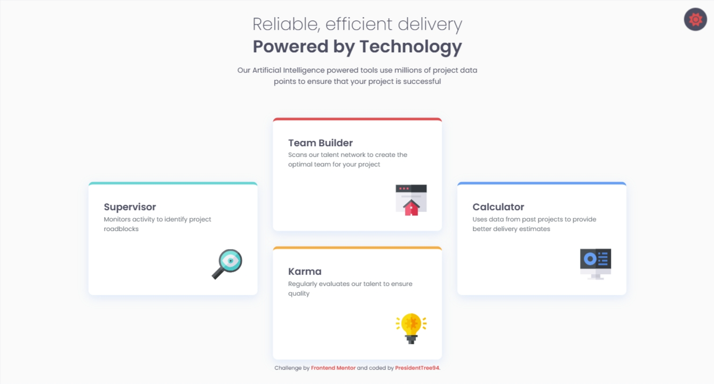

# Four Card Feature Section
This is a solution to the [Four Card Feature Section](https://www.frontendmentor.io/challenges/four-card-feature-section-weK1eFYK) challenge on Frontend Mentor. Frontend Mentor challenges help you improve your coding skills by building realistic projects.

## Overview
As part of the [Building responsive layouts](https://www.frontendmentor.io/learning-paths) learning pathway, it is the second of four challenges users complete to finish the unit.

### Screenshot

### Modifications
I added Dark Mode to the website. The `alt-mode` folder contains a separate README explaining how it works. The button is located in the top-right corner of the page and scales down slightly when selected.

### Links
- Solution URL: [Frontend Mentor Solution Page](https://www.frontendmentor.io/solutions/four-card-feature-section-VILMXR5SVO)
- Live Site URL: [GitHub Page](https://presidenttree94.github.io/four-card-feature-section/)

## Authors
- GitHub Profile: [PresidentTree94](https://github.com/PresidentTree94)
- Frontend Mentor Profile: [PresidentTree94](https://www.frontendmentor.io/profile/PresidentTree94)
- Author Website: [PresidentTree94 Portfolio](https://presidenttree94.github.io/project-portfolio/)
